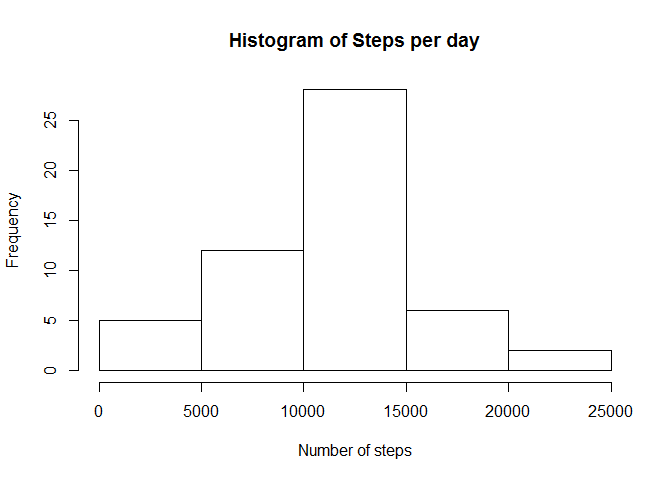
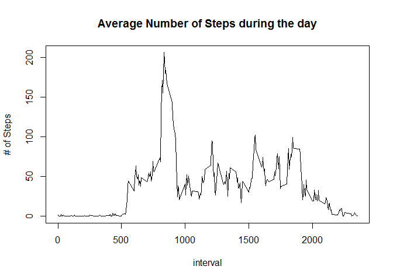
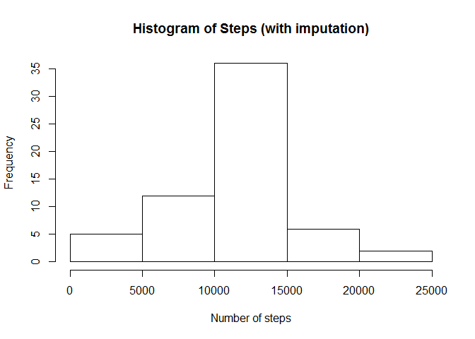
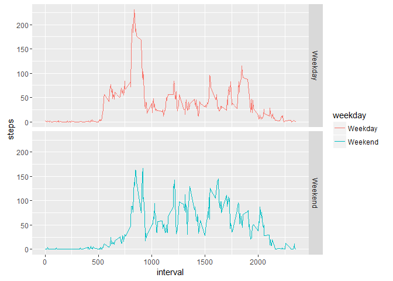

# Untitled
K. Scott Alberts  
June 24, 2016  
Reproducable Research, Course Project #1 - Step Counting

### Setup
First, install key packages, and download and import the raw data file.


```r
#Project 1 - Movement devices
#load packages
library(dplyr)
```

```
## 
## Attaching package: 'dplyr'
```

```
## The following objects are masked from 'package:stats':
## 
##     filter, lag
```

```
## The following objects are masked from 'package:base':
## 
##     intersect, setdiff, setequal, union
```

```r
library(ggplot2)

#download file from webpage and upzip- only do this the first time
#URL<- "https://d396qusza40orc.cloudfront.net/repdata%2Fdata%2Factivity.zip"
#download.file(URL, destfile="activity.zip")
#unzip("activity.zip")

#input
raw <- read.csv("activity.csv", na.strings = "NA") #raw file, pre-processing.
```

### Process the data for the project.

```r
#processing
Activity <- raw #file for processing
Activity$date <- as.Date(Activity$date, "%Y-%m-%d") #convert to a Date
```

## What is the mean total number of steps taken per day?
1. Calculate the total number of steps taken per day
2. Make a histogram of the total number of steps taken each day
3. Calculate and report the mean and median of the total number of steps taken per day


```r
#mean total steps per day
DateSum <- Activity %>% group_by(date) %>% summarize(steps=sum(steps))
hist(DateSum$steps, main="Histogram of Steps per day", xlab="Number of steps")
```

<!-- -->

```r
MeanSteps <- mean(DateSum$steps, na.rm=TRUE)
MedianSteps<- median(DateSum$steps, na.rm=TRUE)
MeanSteps
```

```
## [1] 10766.19
```

```r
MedianSteps
```

```
## [1] 10765
```
####The **Mean** number of steps taken per day is **10766.19 steps**.  
####The **Median** number of steps taken per day is **10765 steps**.  
    
### What is the average daily activity pattern?
1. Make a time series plot (i.e. type = "l") of the 5-minute interval (x-axis) and the average number of steps taken, averaged across all days (y-axis)
1. Which 5-minute interval, on average across all the days in the dataset, contains the maximum number of steps?


```r
#daily pattern
ActivityOmit <- na.exclude(Activity)
TimeMean <- ActivityOmit %>% group_by(interval) %>% summarise(steps=mean(steps))
MeanTime <- mean(TimeMean$steps)
plot(TimeMean$interval, TimeMean$steps, type = "l", 
     main= "Average Number of Steps during the day", 
     xlab="interval", ylab="# of Steps")
```

<!-- -->

```r
TimeMean[which.max(TimeMean$steps),]
```

```
## Source: local data frame [1 x 2]
## 
##   interval    steps
##      (int)    (dbl)
## 1      835 206.1698
```
####The Maximum Average Number of steps is **206.17** at interval **835**.  

###Imputing missing values
***Note that there are a number of days/intervals where there are missing values (coded as NA). The presence of missing days may introduce bias into some calculations or summaries of the data.*** 

1. Calculate and report the total number of missing values in the dataset (i.e. the total number of rows with NAs)  
1. Devise a strategy for filling in all of the missing values in the dataset. The strategy does not need to be sophisticated. For example, you could use the mean/median for that day, or the mean for that 5-minute interval, etc.  
1. Create a new dataset that is equal to the original dataset but with the missing data filled in.  
1. Make a histogram of the total number of steps taken each day and Calculate and report the mean and median total number of steps taken per day. Do these values differ from the estimates from the first part of the assignment? What is the impact of imputing missing data on the estimates of the total daily number of steps?  


```r
#imputing
##strategy - use interval mean for missing data.
ActivityImpute<-Activity
MissingValues <- is.na(ActivityImpute$steps)
IntervalAverage <- tapply (ActivityImpute$steps, ActivityImpute$interval, 
                           mean, na.rm=TRUE, simplify=TRUE)
ActivityImpute$steps[MissingValues] <- IntervalAverage[as.character(
      ActivityImpute$interval[MissingValues])]

DateSumImpute <- ActivityImpute %>% group_by(date) %>% summarise(steps=sum(steps))
hist(DateSumImpute$steps, main="Histogram of Steps (with imputation)",
     xlab="Number of steps")
```

<!-- -->

```r
MeanDateImpute <- mean(DateSumImpute$steps, na.rm=TRUE)
MedianDateImpute<- median(DateSumImpute$steps, na.rm=TRUE)
```
####Because the imputation method kept the averages the same, including the imputed average values doesn't change the mean or the median.

###Are there differences in activity patterns between weekdays and weekends?
1. Create a new factor variable in the dataset with two levels – “weekday” and “weekend” indicating whether a given date is a weekday or weekend day.
1. Make a panel plot containing a time series plot (i.e. type = "l") of the 5-minute interval (x-axis) and the average number of steps taken, averaged across all weekday days or weekend days (y-axis). See the README file in the GitHub repository to see an example of what this plot should look like using simulated data.  

```r
ActivityWeekend <- ActivityImpute
ActivityWeekend$day <- weekdays(ActivityWeekend$date)
ActivityWeekend <- ActivityWeekend %>% 
      mutate(weekday = ifelse(weekdays(ActivityWeekend$date)== "Saturday" | 
             weekdays(ActivityWeekend$date)=="Sunday", "Weekend", "Weekday"))
ActivityWeekend$weekday <- as.factor(ActivityWeekend$weekday)
TimeMeanWeekend <- ActivityWeekend %>% group_by(weekday,interval) %>% 
      summarise(steps=mean(steps))
ggplot(TimeMeanWeekend, aes(x=interval, y=steps, color=weekday)) +
      geom_line() + facet_grid(weekday~.)
```

<!-- -->
  
####We can see a small difference on the weekends, most notably that the actions starts a little bit later in the morning.
